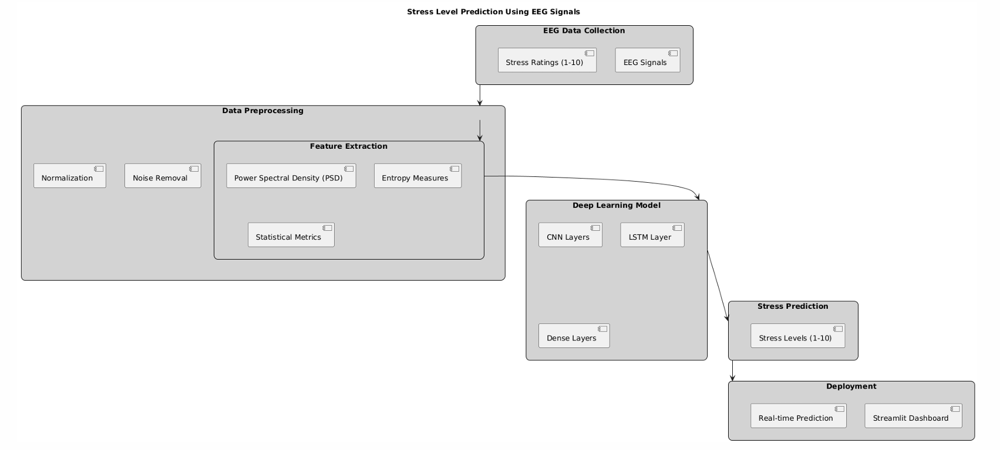
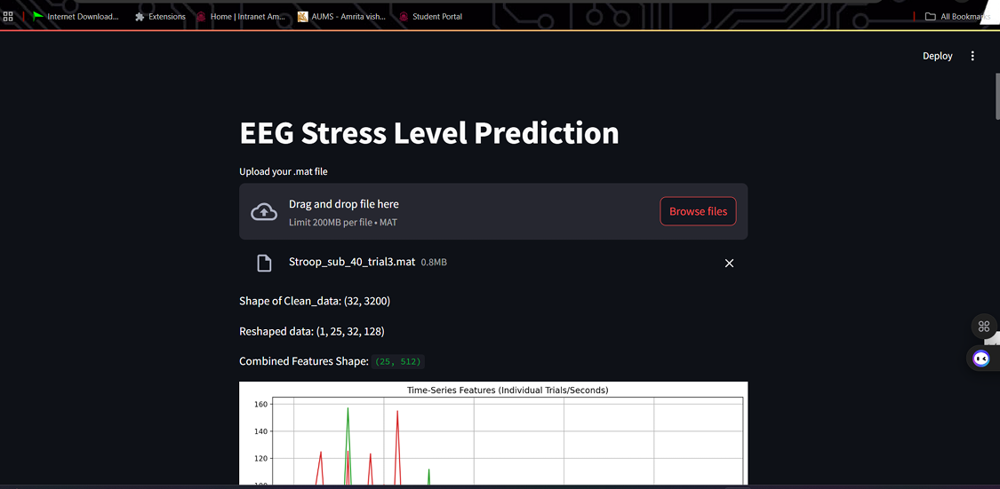
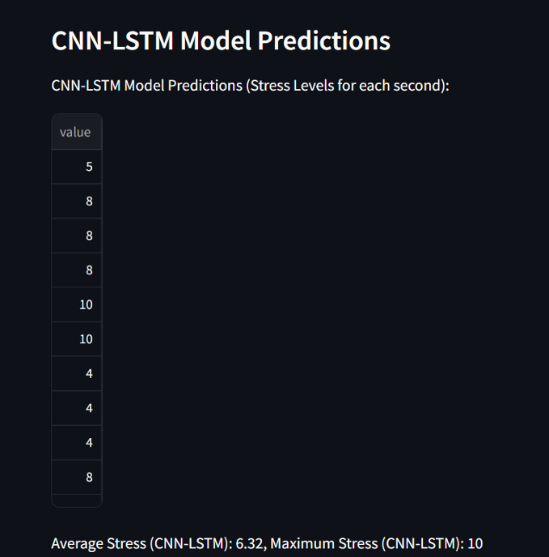

# EEG Stress Level Prediction using CNN + LSTM 🧠📊

A deep learning-based system for predicting human stress levels on a continuous scale (1 to 10) using EEG signals. This project leverages advanced signal processing, feature extraction, and hybrid CNN–LSTM modeling, along with a real-time Streamlit dashboard.

---

## 📁 Project Structure
```
EEG-Stress-Prediction/
│
| 
├── variables.py 
├── dataset.py 
├── features.py 
├── filtering.ipynb 
├── classification.ipynb # Trains ML/DL models (SVM, RF, MLP, CNN+LSTM) and saves the best models
│
├── models/
│ └── trained_model.h5 
│
├── app.py # Streamlit web application for live EEG prediction
└── README.md # Project documentation
```

---

## 📌 Description

This project addresses the need for real-time, precise, and continuous stress assessment using EEG data. Traditional methods (manual or binary classification) fall short in capturing the nuanced variations in stress levels over time.

Key Highlights:

- **Dataset**: 40 subjects, 32-channel EEG, sampled at 128 Hz during Stroop, arithmetic, and mirror image tasks.
- **Labels**: Subjective stress scores (1–10) per trial.
- **Preprocessing**: Bandpass filtering (0.5–40 Hz), ICA for artifact removal, wavelet denoising, and epoch segmentation.
- **Feature Extraction**:
  - Time-domain: Variance, RMS, Peak-to-Peak
  - Frequency-domain: PSD (Delta to Gamma)
  - Hjorth Parameters: Mobility, Complexity
  - Fractal Dimensions: HFD, KFD
  - Entropy Metrics: ApEn, SampEn, Spectral, SVD
- **Models Compared**:
  - SVM → **55%**
  - Random Forest → **72%**
  - MLP → **81%**
  - **CNN + LSTM** → **89%**
- **Deployment**: Streamlit app allows real-time EEG input, predicts stress, and gives feedback.

---

## 📋 Dataset Discription

- EEG Dataset for Cognitive Load and Stress Assessment During Task Performance

**Link**: https://www.sciencedirect.com/science/article/pii/S2352340921010465[https://www.sciencedirect.com/science/article/pii/S2352340921010465]

- This EEG dataset, sourced from a study on cognitive load and stress, includes recordings from participants performing tasks such as the Stroop Color-Word test, arithmetic problem-solving, and mirror image recognition. EEG signals were captured across multiple trials, with subjects providing stress ratings on a scale of 1-10 after each task. 
- It has 32 Channels of EEG signal for each person


## 🧠 Applications

- Mental Health Monitoring: Real-time assessment of emotional and cognitive states.
- Workplace Wellness: Monitor employee stress during critical tasks.
- Education: Track cognitive load in e-learning environments.
- Gaming / UX: Measure user emotional responses.
- BCI Systems: Integrate with neurofeedback and self-regulation systems.


## 📊 Flow Diagram




## 🖼️ Webpage




---
## 🔮 Future Work

- 📈 Regression Modeling: Direct stress value regression instead of classification.
- 🌐 Multimodal Fusion: Combine EEG with ECG, GSR, respiration.
- 🧠 Transfer Learning: Fine-tune models for individual calibration.
- 🧾 Chatbot Advisor: Expand personalized recommendations via LLM integration.
- 📊 Extended Dashboard: Historical trends, insights, and user reports.

---
👥 Contributors

- Kolla Lokesh
- Tharun Balaji
- Naga Koushik
- Bhavya Sainath
